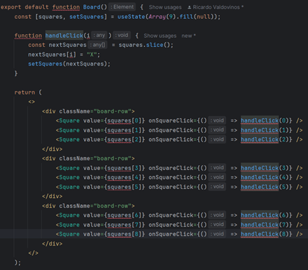

#### <div align="end">Вайцеховський Олександр ІПЗ 3-02</div>
### <div align="center">Практичну заняття №5</div>
#### Тема: Ознайомлення з React через інтерактивний туторіал, основи компонентного підходу
#### Мета: Ознайомитися з базовими концепціями бібліотеки React, зокрема з компонентним підходом, декларативним стилем опису інтерфейсів та принципом оновлення стану. Сформувати початкове уявлення про створення інтерфейсів за допомогою React та підготуватись до реалізації власних UI-компонентів.

#### Хід роботи:

#### Базовий рівень, ознайомлення з матеріалом:

1. Ознайомлення із матеріалом на розділі QUICK Start на сайті react.dev/learn
2. Фіксація отриманих знань:
...*JSX: Синтаксис, що дозволяє писати HTML у JavaScript-коді React-компонентів. Наприклад: <div>Hello</div>.
...*Функціональні компоненти: Компоненти, які є функціями і повертають JSX. Вони прості та часто використовуються з хуками.
...*Props: Об'єкти, що передають дані від батьківського до дочірнього компонента. Наприклад: <User name="Anna" />.
...*State: Локальні змінні компонента, які зберігають динамічні дані. Змінюються за допомогою useState.
...*Обробка подій: Використовується для реакції на дії користувача, як-от клік. Наприклад: <button onClick={handleClick}>Click</button>.
...*Рендеринг списків: Відображення масивів за допомогою .map(). Кожен елемент повинен мати унікальний key.
...*Умовний рендеринг: Відображення елементів в залежності від умови. Наприклад: {isLoggedIn ? <Profile /> : <Login />}.
...*Односторонній потік даних: Дані передаються зверху вниз (від батька до дітей). Компоненти не можуть змінювати props, лише читати.

#### Поглиблений рівень, виконання практичного завдання:

3. Виконання туторіалу на тему ігри Tic-Tac-Toe(Хрестики-Нулики)
...*Створення простої кнопки на сторінці  
  
  
...*Додавання ще однієї кнопки до форми  
  
  
...*Просте поле:  
  
  
...*Налаштування відображення поля кліток  
  
  
...*Очистка поля від цифр  
  
  
...*Надання полю значень масиву кліток  
  
  
...*Створення функції обробника події натискання  
  
  
...*Заповнення клітинки хрестиком при натисканні за допомогою хуку useState()  
  
  
...*Створення окремої змінної стану у середовищі сторінки  
  
  
...*Переформатування фунції натискання кнопки, задля відстеження натискання якої саме кнопки відбулося  
  
  
...*Додавання можливості ходу нуликом та розрахунку переможця, завдяки масиву із усіма переможними комбінаціями  
  
  
  
  
...*Створення можливості відображення переможця партії  
  
  
  
  
...*Додавання можливості повернутися на минулий рік і фіналізація сторінки  

```typescript
export default function Game() {
    const [history, setHistory] = useState([Array(9).fill(null)]);
    const [currentMove, setCurrentMove] = useState(0);
    const xIsNext = currentMove % 2 === 0;
    const currentSquares = history[currentMove];

    function handlePlay(nextSquares) {
       const nextHistory = [...history.slice(0, currentMove + 1), nextSquares];
       setHistory(nextHistory);
       setCurrentMove(nextHistory.length - 1);
    }

    function jumpTo(nextMove) {
       setCurrentMove(nextMove);
    }

    const moves = history.map((squares, move) => {
       let description;
       if (move > 0) {
          description = 'Go to move #' + move;
       } else {
          description = 'Go to game start';
       }
       return (
          <li key={move}>
             <button onClick={() => jumpTo(move)}>{description}</button>
          </li>
       );
    });
```


4. Було звернуто увагу на використання хуків станів та самого стану у компонентах сторінки під час створення інтерактивної взаємодії із дошкою.

#### Поглиблене вивчення

5. Ознайомлення з матеріалом Thinking in React:
https://react.dev/learn/thinking-in-react
6. З пройдуеного матеріалу було виписано такі деталі:
...*Визначення та декомпозиція компонентів на основі макету: Розділення інтерфейсу на маленькі, повторно використовувані компоненти згідно з макетом. Кожен візуально самостійний блок — окремий компонент.
...*Побудова ієрархії компонентів: Компоненти організовуються у структуру "батько-дитина". Верхні компоненти керують станом, а нижні — відображають UI.
...*Розміщення стану у відповідному компоненті: Стан розміщується у найвищому спільному компоненті, який його використовує. Це дозволяє ефективно передавати дані вниз через props.
...*Передача даних через props між компонентами: Батьківський компонент передає дані дочірнім через атрибути. Наприклад: <Profile user={currentUser} />.

### Висновки:
Протягом цієї роботи було засвоєно основи теоритичної бази фреймворку REACT. Був пройденний невеликий курс із фундаментальними знаннями про ведення розробки на цьому технічному рішені. Протягом практики було виконано невеличке завдання по створеню інтерактивного застосунку, котрий використовував компонентний підхід.

##### Фінальний код сторінки:
```typescript
import { useState } from 'react';

function Square({ value, onSquareClick }) {
    return (
       <button className="square" onClick={onSquareClick}>
          {value}
       </button>
    );
}

function Board({ xIsNext, squares, onPlay }) {
    function handleClick(i) {
       if (calculateWinner(squares) || squares[i]) {
          return;
       }
       const nextSquares = squares.slice();
       if (xIsNext) {
          nextSquares[i] = 'X';
       } else {
          nextSquares[i] = 'O';
       }
       onPlay(nextSquares);
    }

    const winner = calculateWinner(squares);
    let status;
    if (winner) {
       status = 'Winner: ' + winner;
    } else {
       status = 'Next player: ' + (xIsNext ? 'X' : 'O');
    }

    return (
       <>
          <div className="status">{status}</div>
          <div className="board-row">
             <Square value={squares[0]} onSquareClick={() => handleClick(0)} />
             <Square value={squares[1]} onSquareClick={() => handleClick(1)} />
             <Square value={squares[2]} onSquareClick={() => handleClick(2)} />
          </div>
          <div className="board-row">
             <Square value={squares[3]} onSquareClick={() => handleClick(3)} />
             <Square value={squares[4]} onSquareClick={() => handleClick(4)} />
             <Square value={squares[5]} onSquareClick={() => handleClick(5)} />
          </div>
          <div className="board-row">
             <Square value={squares[6]} onSquareClick={() => handleClick(6)} />
             <Square value={squares[7]} onSquareClick={() => handleClick(7)} />
             <Square value={squares[8]} onSquareClick={() => handleClick(8)} />
          </div>
       </>
    );
}

export default function Game() {
    const [history, setHistory] = useState([Array(9).fill(null)]);
    const [currentMove, setCurrentMove] = useState(0);
    const xIsNext = currentMove % 2 === 0;
    const currentSquares = history[currentMove];

    function handlePlay(nextSquares) {
       const nextHistory = [...history.slice(0, currentMove + 1), nextSquares];
       setHistory(nextHistory);
       setCurrentMove(nextHistory.length - 1);
    }

    function jumpTo(nextMove) {
       setCurrentMove(nextMove);
    }

    const moves = history.map((squares, move) => {
       let description;
       if (move > 0) {
          description = 'Go to move #' + move;
       } else {
          description = 'Go to game start';
       }
       return (
          <li key={move}>
             <button onClick={() => jumpTo(move)}>{description}</button>
          </li>
       );
    });

    return (
       <div className="game">
          <div className="game-board">
             <Board xIsNext={xIsNext} squares={currentSquares} onPlay={handlePlay} />
          </div>
          <div className="game-info">
             <ol>{moves}</ol>
          </div>
       </div>
    );
}

function calculateWinner(squares) {
    const lines = [
       [0, 1, 2],
       [3, 4, 5],
       [6, 7, 8],
       [0, 3, 6],
       [1, 4, 7],
       [2, 5, 8],
       [0, 4, 8],
       [2, 4, 6],
    ];
    for (let i = 0; i < lines.length; i++) {
       const [a, b, c] = lines[i];
       if (squares[a] && squares[a] === squares[b] && squares[a] === squares[c]) {
          return squares[a];
       }
    }
    return null;
}
```
